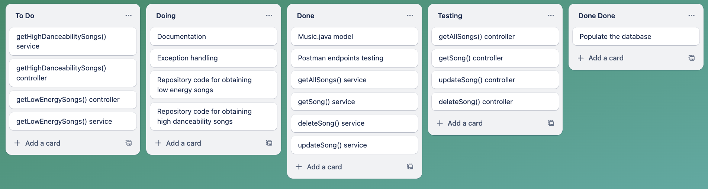

# Java Music API

## Description

A simple API to store your favourite songs. This allows you to view all songs, select them by ID, delete them or update them.
It also includes two additional routes: one that shows the 15 songs with the highest danceability score, and the second one 15 songs with the lowest energy.

## Configuration

### Endpoints

This project supports all CRUD operations, but it also includes two custom routes /highdanceability and /lowenergy

| Method | Endpoint                | Description                                  |
| ------ | ----------------------- | -------------------------------------------- |
| GET    | /music                  | Retrieves all songs                          |
| GET    | /music/{id}             | Retrieves song specified by the {id}         |
| POST   | /music                  | Create a new song                            |
| PUT    | /music/{id}             | Updates song specified by the {id}           |
| GET    | /music/highdanceability | Retrieves 15 songs with highest danceability |
| GET    | /music/lowenergy        | Retrieves 15 songs with lowest energy        |

### Database

All data is stored in a single table called music.


**Note:** A Universally unique identifier (UUID) is a 128-bit label utilised to identify information.

### Project Management

For this project a Kanban board was implemented to organise tasks and visualise progress.



## Setup and Installation

### Prerequisites

These are the project prerequisites:

1. JDK 21
2. MySQL 9.0.1

### Clone Repository

1. Fork this repository in your GitHub account
2. Clone your fork locally.

```sh
git clone [REPO_URL]
cd [REPO_NAME]
```

**Note:** Replace [REPO_URL] with the link to your GitHub repository and [REPO_NAME] with the repository's name.

### Create Database

#### Working with an existing database

1. Within MySQLWorkbench, select open a SQL script file in a new query tab:
   

2. Follow this path JAVA-MUSIC-API/dump_file.sql and select the sql file

3. You now have access to an existing database

#### Creating your own database

1. Login to MySQL:

```sh
mysql -u root -p
```

**Note:** If your root user doesn't have a password set, omit the `-p` flag.

2. Create a new database:

```sh
CREATE DATABASE IF NOT EXISTS musicapi;
exit;
```

3. To store data about your songs within the music table in the musicapi database, use the following command:

```sh
INSERT INTO musicapi.music (id, song, artist, year, genre, description, duration_sec, bpm, energy, danceability)
VALUES (UUID_TO_BIN(UUID()), "song name", "artist name", release year, "song genre", "song description", duration_sec, bpm, energy, danceability);
```

**Note:** This part of the code: UUID_TO_BIN(UUID()) is essential as the UUID is stored within the database as binary.

### Create local.properties file

1. In this directory: src/main/resources
   create a local.properties file

2. Fill this file with the following content:

```properties
spring.datasource.url=jdbc:mysql://localhost:3306/musicapi

# Replace "root" with your database user, if applicable
spring.datasource.username=root

# Specify your database user's password, if applicable. If your database user doesn't have a password set, delete the line below
spring.datasource.password=YOUR_MYSQL_PASSWORD
```

3. Replace the spring.datasource.username and spring.datasource.password values with your MySQL credentials. **IMPORTANT:** Ensure there are no spaces before or after the password.

### Run Application

To start the API, run the following command:

#### macOS / Git Bash

```sh
./mvnw spring-boot:run
```

#### Windows Command Prompt

```cmd
mvnw spring-boot:run
```

If successful, you should see output that ends similarly to the following:

```
2025-03-01T15:54:04.286Z  INFO 3479 --- [java-music-api] [  restartedMain] o.s.b.w.embedded.tomcat.TomcatWebServer  : Tomcat started on port 8080 (http) with context path '/'
2025-03-01T15:54:04.289Z  INFO 3479 --- [java-music-api] [  restartedMain] c.m.j.JavaMusicApiApplication            : Started JavaMusicApiApplication in 1.401 seconds (process running for 1.563)
```

The application will running at http://localhost:8080/music

### Stop Application

Stop the application by pressing: `Ctrl + C`

### Application Testing

This project includes unit testing, to run the tests use the following command:

```sh
./mvnw test
```

## Usage

To implement this API you can utilise Postman or any other REST client at http://localhost:8080/music

The following is the format of a response or the request body required for the POST and PUT requests:

```
{
    "song": "song name",
    "artist": "song artist",
    "year": release year,
    "genre": "song genre",
    "description": "song genre",
    "bpm": bpm value,
    "energy": energy value,
    "danceability": danceability value,
    "duractionSec": duractionSec value
}

```

**Note:** To avoid errors ensure that durationSec is written in camel case and not in the same format as in the database (duration_sec)
